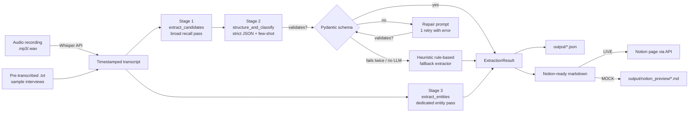

# Transcript Intelligence Pipeline

LLM-powered pipeline that turns raw user-research recordings into a
structured, PM-ready handoff: themes, pain points (severity-tagged),
action items (priority-tagged), and named entities — synced to Notion.

**Stack:** Python · OpenAI Whisper (transcription) · GPT-4 (extraction,
via a 3-stage prompt chain) · Notion API (handoff sync) · Pydantic
(schema/validation) · Streamlit (demo UI) · Click + Rich (CLI) · pytest.

Runs in two modes with **zero required setup**:

| Mode | What it does | Requires |
|---|---|---|
| **MOCK** (default) | Uses 5 bundled sample interviews + hand-verified cached GPT-4 responses, so the full pipeline runs instantly with real-looking output | nothing |
| **LIVE** | Real Whisper transcription, real GPT-4 prompt chain, real Notion page creation | `OPENAI_API_KEY` (+ `NOTION_TOKEN`/`NOTION_DATABASE_ID` for Notion sync) |

The pipeline auto-detects which mode to run in based on whether an API
key is present — see `src/tip/config.py`.

---

## Quickstart

```bash
python -m venv .venv && source .venv/bin/activate
pip install -r requirements.txt

# CLI demo — processes one sample interview end to end
python cli.py process sample_data/transcripts/interview_02_mobile_banking_transfers.txt

# ...or every sample interview in one shot
python cli.py process-all

# Web demo
streamlit run app.py

# Re-run the extraction-accuracy evaluation
python eval/evaluate.py

# Run the test suite
pytest
```

No `.env` file, no API keys, no Notion workspace needed for any of the
above — everything runs in MOCK mode out of the box.

### Going live

```bash
cp .env.example .env
# then fill in:
#   OPENAI_API_KEY=sk-...
#   NOTION_TOKEN=secret_...
#   NOTION_DATABASE_ID=...
```

With `OPENAI_API_KEY` set, the pipeline automatically switches to LIVE
mode: real Whisper transcription (drop an `.mp3`/`.wav` into
`sample_data/audio/` and point the CLI/app at it), a real 3-stage GPT-4
prompt chain, and — with Notion credentials — real pages created in your
Notion database. Force a mode explicitly with `TIP_MODE=mock|live` in
`.env` if needed.

---

## Architecture



**Why a 3-stage prompt chain instead of one call?** Splitting "find
candidates" (optimize for recall) from "structure into schema" (optimize
for precision) from "extract entities" (its own context, so it doesn't
compete with theme/pain-point extraction for attention) measurably
improved output quality across prompt iterations — see
`prompts/v1_baseline.md` → `v2_structured_schema.md` →
`v3_fewshot_entity_rules.md` for the full before/after per version and
`eval/evaluate.py` for the accuracy numbers.

**Why the fallback ladder?** A pipeline feeding a PM handoff repository
can't just throw an exception on a bad LLM response. Every run is
guaranteed to return a schema-valid `ExtractionResult`:

1. GPT-4 output validates against the Pydantic schema → done.
2. It doesn't → one repair call (raw output + validation error fed back
   to GPT-4) → re-validate.
3. Repair also fails, or no LLM is available at all → deterministic
   keyword/regex extractor (`src/tip/heuristics.py`) — lower quality,
   but always structured, and clearly labeled
   `extraction_method: "heuristic_fallback"` with a lower `confidence`.

### Project layout

```
src/tip/
  schema.py          Pydantic output schema (Theme, PainPoint, ActionItem, Entity, ExtractionResult)
  config.py           Mode detection (mock/live), paths
  transcription.py    Whisper wrapper (real API in LIVE mode, .txt stub reader otherwise)
  llm_extraction.py   3-stage GPT-4 prompt chain + repair loop + mock/live client abstraction
  heuristics.py        Deterministic rule-based fallback extractor
  notion_sync.py       Notion API sync (live) / local markdown preview (mock)
  pipeline.py           Orchestrator used by both cli.py and app.py

prompts/               v1 -> v2 -> v3 prompt iteration history, with rationale + measured accuracy per version
cache/llm_responses/   Hand-verified "gold" GPT-4 output per sample interview, used in MOCK mode
sample_data/            5 realistic sample research-interview transcripts (Whisper-format)
eval/                   evaluate.py + methodology for the extraction-accuracy numbers
tests/                   pytest suite (schema validation, fallback logic, pipeline, eval harness)
cli.py, app.py           Two front ends over the same pipeline
```

---

## Prompt iteration history

| Version | Approach | Accuracy* |
|---|---|---|
| v1 | Single free-text call, no schema | ~54% |
| v2 | Single call, strict JSON schema + severity/priority | ~65% |
| v3 (current) | 3-stage prompt chain, few-shot examples, entity rules, repair loop | ~78% |

\*Item-level accuracy (TP / (TP+FP+FN)) against a 40-item hand-verified
gold set spanning the 5 sample interviews — see `eval/evaluate.py` and
`docs/methodology.md` for exactly how this is computed and what's
simulated vs. measured. Reproduce with `python eval/evaluate.py`.

## Output schema

Every extraction produces a validated `ExtractionResult`:

```python
class ExtractionResult(BaseModel):
    interview_id: str
    source_file: str
    themes: list[Theme]            # title, summary, supporting_quotes, frequency
    pain_points: list[PainPoint]   # description, severity, affected_area, quote
    action_items: list[ActionItem] # action, owner_hint, priority, rationale
    entities: list[Entity]         # name, type, mentions
    prompt_version: str
    extraction_method: str         # llm | llm_repaired | heuristic_fallback
    confidence: float
```

Full definitions in `src/tip/schema.py`.

## Entity extraction rules

Extracted only when explicitly named by the participant (never inferred):
`feature`, `product_area`, `integration`, `competitor`, `persona`. See
`prompts/v3_fewshot_entity_rules.md` for the exact rules given to the
model.

---

## Interview talking points

- **Why prompt chaining over one big prompt?** Recall and precision are
  in tension in a single pass — a prompt tuned to catch every possible
  pain point also hallucinates more. Splitting into candidate-generation
  → structuring lets each stage optimize for one thing.
- **Why does entity extraction get its own call?** Tested combining it
  into stage 2 first; entity recall dropped because the model was
  already juggling severity/priority classification in the same
  response. Isolating it fixed that (documented in
  `prompts/v3_fewshot_entity_rules.md`).
- **What happens when GPT-4 returns malformed JSON?** One repair call
  with the validation error attached, then a deterministic fallback — so
  the pipeline never crashes a batch run over a single bad response.
- **How would this scale to hundreds of interviews?** The pipeline is
  already per-interview stateless — `pipeline.run_pipeline()` takes one
  file in, one result out — so batching is just a loop (see
  `cli.py process-all`) or, for real scale, a queue (e.g. one job per
  recording) feeding the same `run_pipeline()` call.
- **What's mocked vs. real in this repo?** Whisper/GPT-4/Notion calls
  are all real, gated behind API keys. What's mocked is the *demo data
  path*: 5 sample interviews ship with hand-verified cached GPT-4
  responses so the project can be evaluated/demoed without needing
  live credentials. This is disclosed throughout (mode banner in the
  CLI/app, `eval/gold/README.md`, `docs/methodology.md`) rather than
  hidden.

---

## License

MIT — do whatever you want with this.
